# 🚀 TikGrow — TikTok Automation & Growth Tool

🌏 Language:
- English (current)
- 中文版: [README_CN.md](./readme.zh.md)

> A powerful TikTok automation tool designed for marketing, lead generation, and workflow optimization.

---

## ✨ What is TikGrow?

**TikGrow** is an advanced TikTok automation solution built on a fully self-developed RPA framework.

It helps users:
- Automate repetitive TikTok operations  
- Improve marketing efficiency  
- Scale outreach and engagement  
- Reduce manual workload  

---

## 🔥 Key Features

- 🤖 **Automated Interaction**
  - Comment automation
  - Smart reply system
  - AI-powered content generation

- 🚀 **Advanced RPA Engine**
  - Built on a proprietary framework (NOT Auto.js)
  - High stability & compatibility
  - Optimized for long-running tasks

- 🎯 **Marketing Automation**
  - Lead generation workflows
  - Engagement automation
  - Custom campaign logic

- 🎨 **White-label Support**
  - Custom logo & branding
  - Theme customization
  - Build your own SaaS product

- 💻 **Full Backend System**
  - User management
  - Data analytics
  - Agent/reseller system

- 🛠️ **Custom Development**
  - Tailored automation solutions
  - Multi-device / batch control
  - Private deployment options

---

## 🧠 Built on Real Experience

TikGrow is evolved from a mature product used in real-world scenarios for over **3 years**.

It incorporates:
- Proven automation strategies  
- Stability improvements  
- UX optimizations  
- Scalable architecture  

---

## 📸 Screenshots

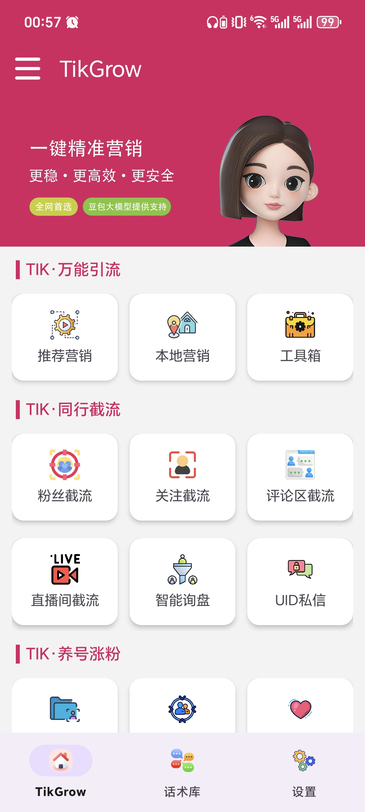
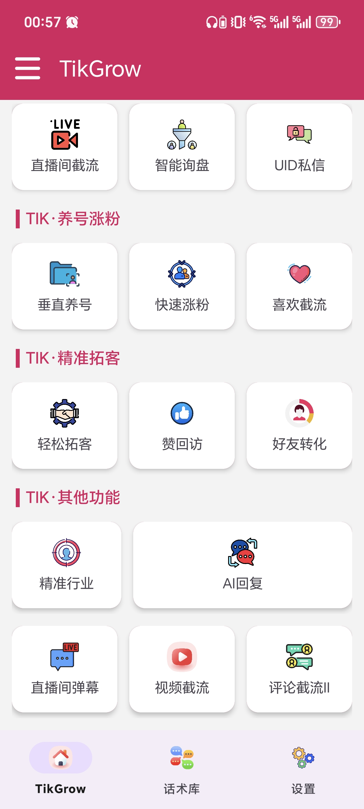

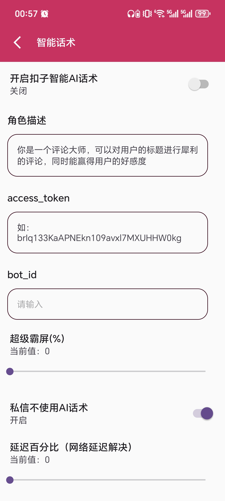
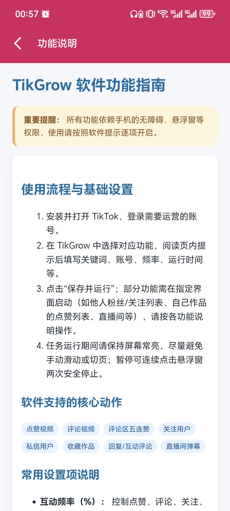
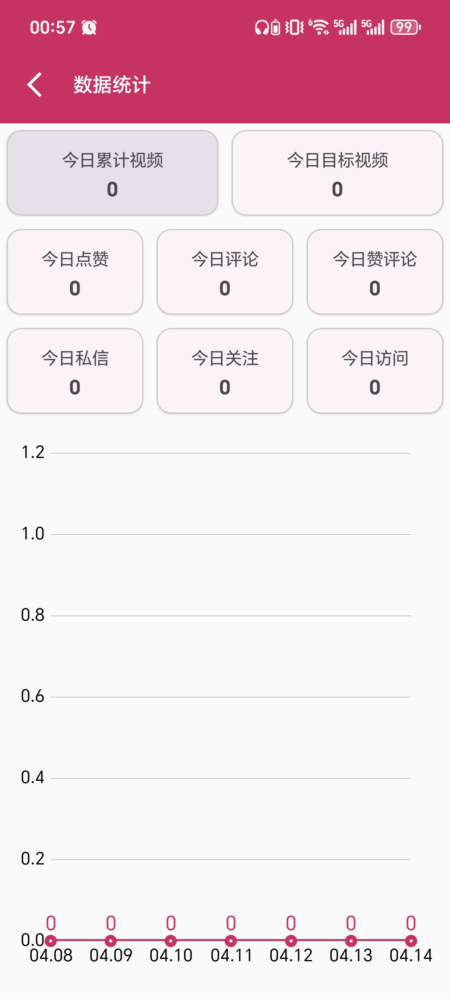
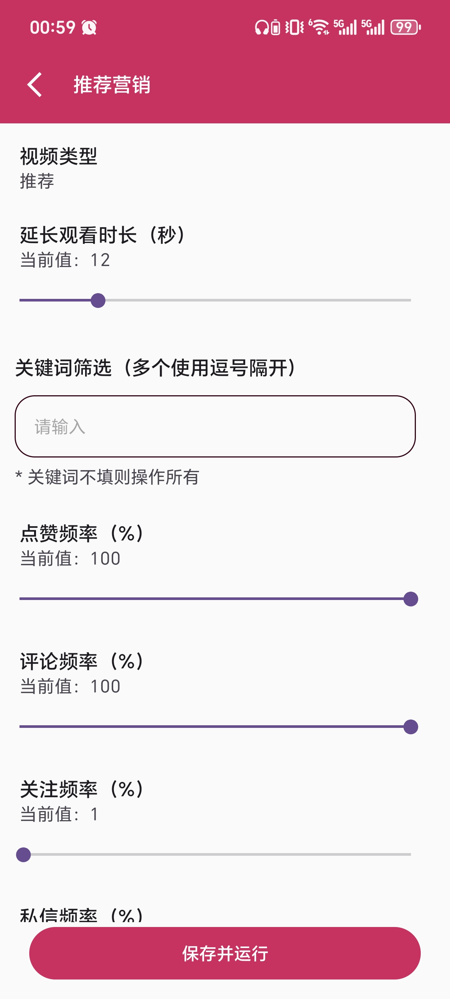

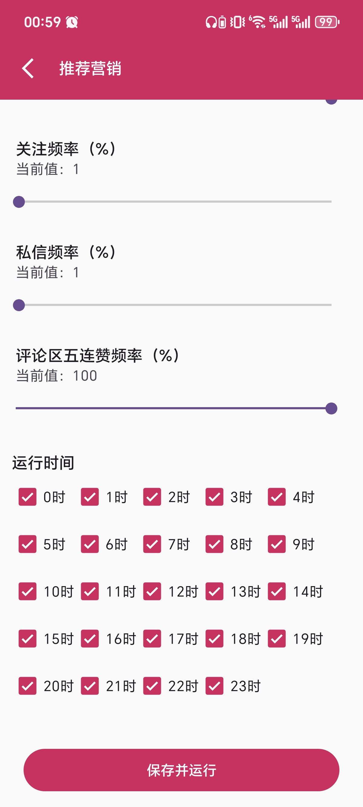

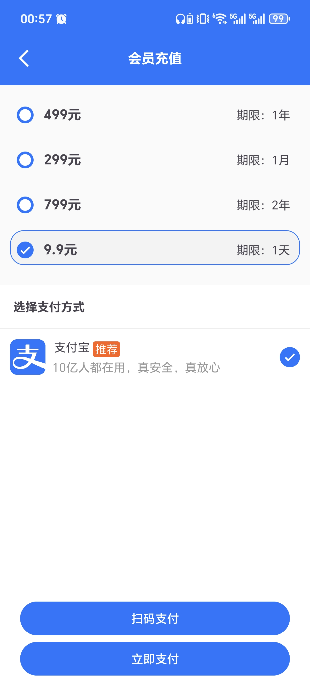

---

## 💻 Admin Panel

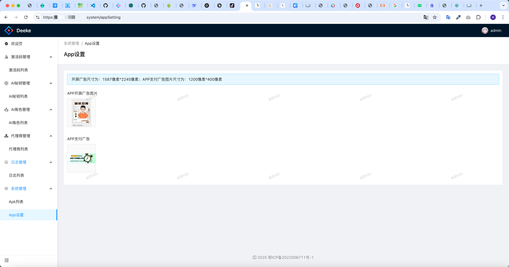
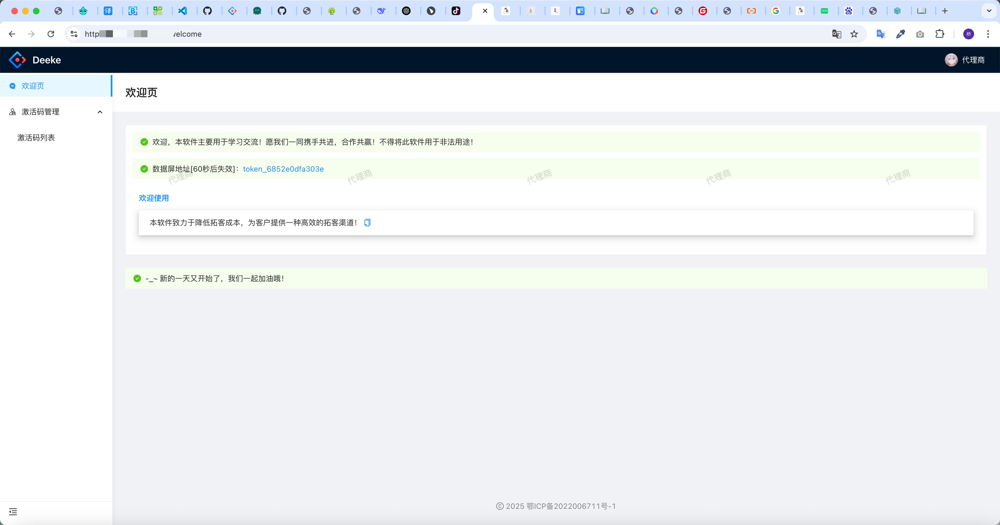
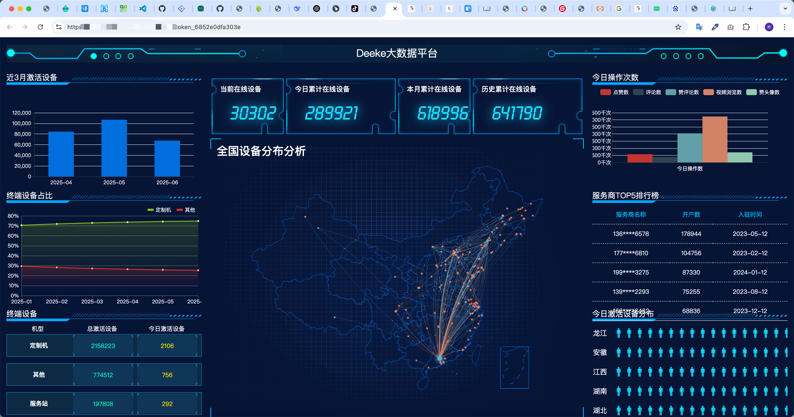

---

## ⚡ Why TikGrow?

- ✅ Self-developed core framework (full control & stability)  
- ✅ Simple UI, easy to use  
- ✅ Scalable for business use  
- ✅ Suitable for agencies & resellers  
- ✅ Continuous updates  

---

## ⚠️ Disclaimer

This project is intended for:
- Learning automation concepts  
- Workflow optimization  
- Technical research  

Users are responsible for complying with TikTok’s Terms of Service and local regulations.

---

## 🤝 Collaboration & Contact

We provide:
- Custom development  
- White-label solutions  
- Business cooperation  

📩 Contact:  
(See image below)

---

## ❤️ Final Words

If you're looking to build:
- a TikTok automation system  
- a marketing tool  
- or your own SaaS product  

👉 TikGrow can be your starting point.

---

# 🚀 Boost your efficiency. Scale your growth.

⭐ If this project helps you, please give it a star!
